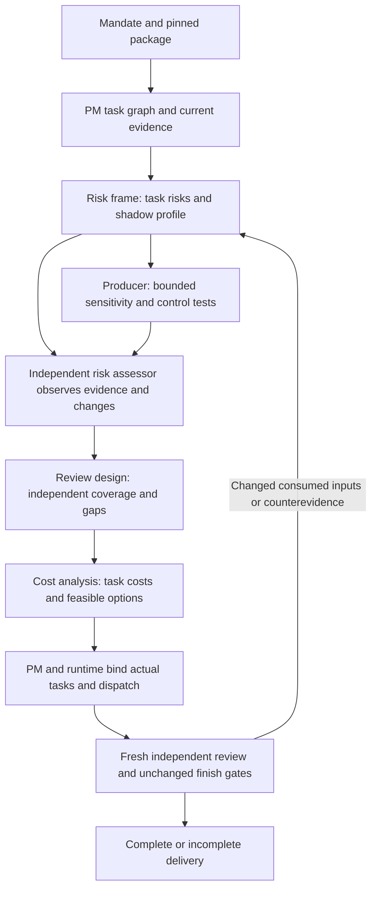

# Risk workflow — source 0.3.0-dev.1

User approval covers this implementation, not adoption of a concrete risk profile. Prior source candidate 0.2.0-dev.1 failed efficiency (user-supplied status); this change neither certifies a replacement nor changes the active installed release. Candidate profiles run only in shadow until concrete scoped adoption. Existing protected quality criteria remain unchanged. Numeric 1% and 0.5% are discussion values, not installed defaults, calibrated assurance or acceptance thresholds.

## Orchestration

The graph routes available methods by mandate; it is not an enforced fixed sequence. PM records risk IDs/object hashes and task IDs/revisions. Runtime verifies pinned component/profile bindings and supported plan facts/artifact references before dispatch; maps cost estimates/actuals and review coverage to the same tasks; records real attempts, receipts and invalidation actions. The engine implements opt-in enforced risk gates; the bundled candidate profile remains unapproved and installs no production reduction defaults. Missing support is reported explicitly, never treated as permission. Source-pack collection belongs to main coordination; supplied standards require exact provenance and applicability. No standard is invented here.

Load [risk-frame](../libraries/skills/risk-frame/SKILL.md) for exposure and profile bindings; [sensitivity-analysis](../libraries/skills/sensitivity-analysis/SKILL.md) for conditional model response; [control-test](../libraries/skills/control-test/SKILL.md) for actual control evidence; [review-design](../libraries/skills/review-design/SKILL.md) for independent coverage; [cost-analysis](../libraries/skills/cost-analysis/SKILL.md) for task cost. [Risk-assessor](../libraries/personas/risk-assessor/ROLE.md) observes evidence and changes independently of reviewed producers; it cannot authorize reduction. Sensitivity is not risk likelihood. Riskfiles record evidence, never authority.

## Package approval and task settings

A package/release approval identifies installable bytes under the existing release gates. It does not adopt all contained profiles. A per-task profile binds ID/version/hash, actual task revisions, criteria and scoped adoption evidence. Proposed settings stay shadow and cannot change dispatch, required tests or finish decisions. Concrete adoption must identify the profile and scope; changes to protected criteria still need their existing explicit authorization. No global installation or activation is part of this work. Valuation execution remains distinct from planning-only FDD/ESG and other unsupported domains.

## Reruns and confidence

A new attempt records its current frozen inputs. Changes to consumed fields, evidence/source versions, calculations, artifacts, criteria, profile, control, task scope or material counterevidence invalidate affected confidence, results and downstream reviews. Preserve prior evidence; map affected nodes, rerun/retest and obtain fresh independent review of exact changed/affected artifacts. Unchanged decisions carry only their evidenced scope and bindings. A repeated output, prior pass or new timestamp does not restore confidence; report missing coverage as restricted/unverified.

## Runtime and cost

Follow [native handoff](native-handoff.md) and [session workflow](session-workflow.md): fork_context=false, task-only packet, inherited model, lower confirmed capacity (maximum six), actual spawn/bind/submit/close receipts, fresh independent reviewer each round, and no reuse of completed workers for new tasks. Methods and persona do not spawn descendants. Preserve requested/resolved/observed values and real limits. Unknown tokens, prices, timings or capacity are unknown, not zero.

Separate package development/sourcepack/environment setup from company work. Each company requires current evidence, calculations, review, rendering and reruns; those costs cannot be hidden as setup. Record forecast versus actual per task/attempt, risk/control coverage, currency/units, rates with source/date, cached/uncached tokens and elapsed intervals. Deduplicate shared costs and use critical path/union intervals for parallel elapsed time rather than summing concurrent durations. Allocate shared setup explicitly when comparing engagements.

Report deadline is exactly **600 seconds = 585 seconds work + 15 seconds preservation and delivery** from the actual request; setup completed beforehand is separate. Starting the risk workflow or rerunning does not restart the clock. 300 seconds remains aspirational. Cost options retain existing quality gates; infeasible work returns an honest incomplete disposition. Full-report benchmarks retain their existing enabled flag, independent quality evaluation and finish gates. Structural validation supplies no production approval.

## Implemented interfaces

Requests select `risk_mode`: `legacy`, `shadow` or `enforced`. Register a versioned assessment through `risk-register`; `risk-review` requires an actual independent risk-role attempt receiving its exact assessment hash. Enforced producer dispatch is blocked until that confirmation and all protected minimum procedures are satisfied. Candidate profiles cannot supply production authority. Input file bytes, pinned component status and protected profile adoption references are checked.

A claim names its `artifact_name` and exact `locator`. `risk-procedure` must supply the same `claim_locator`, current target artifact hashes, a verified examiner attempt with the actual target dependency, and a passed submitted check named `risk/<claim_id>/<procedure>`. Generic passed checks or a previous examiner without that target cannot establish coverage. Source, recalculation, judgment and document procedures require the corresponding independent role. These ledger checks bind observed records; they do not prove the truth of a fabricated host receipt.

`cost-observe` deduplicates actual response IDs and rejects conflicting counts or invented task bindings. Task costs bind actual attempts and revisions. Unbound main receipts may use only `main`, `package-development` or `unattributed` owner labels; task owners require an actual attempt, and explicit empty attempts reject. The `task_attempt` alias must match `attempt_id`; supplied task owners must match the actual bound agent or exact task/agent/revision owner object. `cost-status` separates cached/uncached input and output/reasoning, with unknown values retained. `sensitivity` is a generic linear adapter; `valuation-sensitivity` reuses the finance adapter and marks missing ranges and invalid reconciliations unassessed. Neither creates quantitative materiality thresholds.

`risk-experiment` freezes profile, criteria, reviewer configuration, public/private fixture hashes and protected baselines. `risk-experiment-adopt` requires a real human reference for the exact registration bundle; creating a registration is not adoption. Pair records and their quality/accounting evidence are immutable. Missing overall budget observation cannot certify budget compliance. This release contains implementation and a shadow calibration, not three passed live comparisons or 600-second full-report acceptance.
